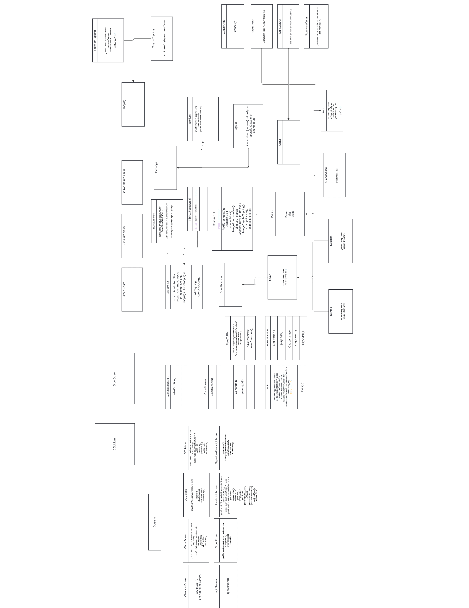

This app has been my favorite project so far. It resembles a sandwich shop,
which customer can order customized sandwiches and signature sandwiches as well.  

At first, the customer can either log in if they have an account, create and account or simply skip login. 
Then they can start their orders right away.
###

## Table Of Content
- [Login Screen](#start-screen)
    - [Scan customer card](#Scan-Card)
    - [Username login](#Username-Login)
    - [Create account](#Create-Account)
    - [Skip login](#Skip-Login)
    - [Exit](#exit)
- [Skip Login](#Skip-Login)
    - [Main Menu](#Main-Menu)
    - [New-Order](#New-Order)
    - [Signature](#Signature)
    - [Log Out](#Log-Out)
- [New Order](#New-Order)
    - [Add Sandwich](#Add-Sandwich)
    - [Add Drink](#Add-Drink)
    - [Add Chips](#Add-Chips)
    - [Check Out](#Check-Out)
    - [Cancel Order](#Cancel-Order)

- [Interesting Code & favorite code](#interesting-code)
    - [Loading Screen](#Loading-Screen)
    - [Outro Animation](#Outro-Animation)
    - [Generate Receipt](#Generate-Receipt)
    - [Play a game?](#Play-A-Game)
- [Class Relationships diagram](#class-relationships-diagram)
###
###

## Installation
You can pull this repository locally to access the program. Make sure to use a Java IDE to run the program, or manually compile with Javac and run with Java. Steps are below to run manually:
1. `git clone https://github.com/oscar-osmig/DELIcious.git`
2. `javac -d out @sources.txt`
3. `java -cp out com.pluralsight.features.Login`

Suggested software:
- [Java JDK](https://www.oracle.com/th/java/technologies/downloads)
- [JetBrains IntelliJ](https://www.jetbrains.com/idea/download/)

If you have **previous Orders** you want to import, you must **add them manually** into the **receipts folder** (you can take a pick how the receipt looks like).

###

# Start Screen
The start screen looks like the following:

The start screen is the login screen in which the user is able to scan there customer card, login with username, make an account, or skip login.  
  
The user must enter the key correlating to the menu item, and press enter. *This is not case-sensitive.*

### Scan Card
This option asks user to input their unique customer ID once it's verified it takes
customer to [DELIcious Screen](#delicious-screen).

### Username Login
This option asks customer for their username and password, if it matches one in record then takes customer
to [DELIcious Screen](#delicious-screen). Else, it asks the customer if they want to make a new account.
### Create Account
This option asks customer to add his username, and password wanted. It also generates a unique ID for the customer. 
Lastly it takes customer to [DELIcious Screen](#delicious-screen).

###

# Skip Login
This option takes customer to [DELIcious Screen](#delicious-screen).
### Exit
This option closes the program.

###

# DELIcious Screen
The home screen looks like the following:

It provides the options for main menu, make a new order, for signature sandwich, and to log out.

The user must enter the key correlating to the menu item, and press enter. *This is not case-sensitive.*

###

### Main Menu
This option displays the available sandwiches on menu.

###

# New Order
This option takes the user to the Order Screen which displays the options to add to the order.  
The following image displays how it looks:

### Add Sandwich
This option starts asking for the ingredients to customize sandwich.

### Add Drink
This option as what time of drink customer wants to add.

### Add Chips
This option as what time of chips customer wants to add.

### Check Out
This option generates a receipt if something was added to the order, 
and asks customer to confirm the order, it also asks customer if 
they want to play a game while their order is being prepared.

### Cancel Order
This option brings back the customer to - [DELIcious Screen](#delicious-screen)

### Signature
This option puts the user into a screen which displays the signature sandwiches.

Here, there are two signature sandwiches.

### Log Out
This option allows you to log out and go back to log in screen.

###

# Interesting Code

### Loading Screen
For this feature, I thought of ways to animate a loading screen. 
My approach was very simple use an array of strings in which I did the
lines that make up each frame, then clear the console, and then used a for loop and put to sleep the thread
in between lines so it gave the appearance of animation.  

Note:
In my case I did 42 lines for the whole animation.  

### Outro Animation
This was a result of imagination from when I did the [Loading Screen](#loading-screen); 
I got a memory from my childhood. Remember when the CD logo bounce of the walls? 
well this was my version of doing that. I wrote a total of over 3,000 lines in order to make such
effect: a total of 280 frames at 24 fps.  
As you will see, the frames look similar to [Loading Screen](#loading-screen).

Note: in order to run at 24 fps you need to put the thread to sleep at
around 42 milliseconds. 

### Generate Receipt
My approach for this was to my surprise more complicated than I needed to do it. I wanted
to generate the receipt as close to a real one. I came to have issues because of the complexity in it.
The most important part of it is below, generating the sandwich part of the receipt.

### Play A Game
This is a game idea I had a long time ago, back then I wasn't able to figure a way to do it.  
After I finish this project early, and after doing [Outro Animation](#outro-animation), I had imagination to start coding
this game, Maaike suggested me to add it as an Easter egg.

###

# Class Relationships Diagram
